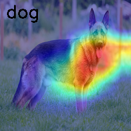

# Explainable AI experiments

This folder contains a few experiment for using explanable AI techniques. Most experiments are conducted using the [Kaggle's cats vs dogs dataset](https://www.kaggle.com/c/dogs-vs-cats)

## How to use the folder

- Install the dependancies:

```
poetry install
```

- Train the cats vs dogs classifier model

```
python src/train/cat_dog_classifier.py
```

This will create a `.ckpt` file


## Supported methods

So far we have few supported XAI methods.

- **Grad-CAM and HiResCAM**:

:star: Note that for this method you will need a `trained` model.

```bash
python src/xai_methods/cam.py --img ./assets/images/dog.png --output src/xai_methods/dog_hirescam.png --method hirescam
```

This will give you the following result:




- **Deep Feature Factorization**:

:star: Note that for this method you do not need a trained model as we only use a `fine-tuned` model.
 
```bash
python src/xai_methods/dff.py --img ./assets/images/dog.png --output src/xai_methods/dog_dff.png --n_components 2  
```

This will give you the following result:

